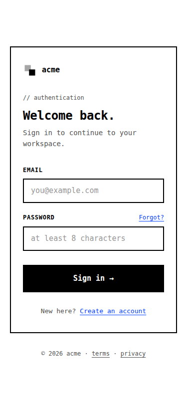
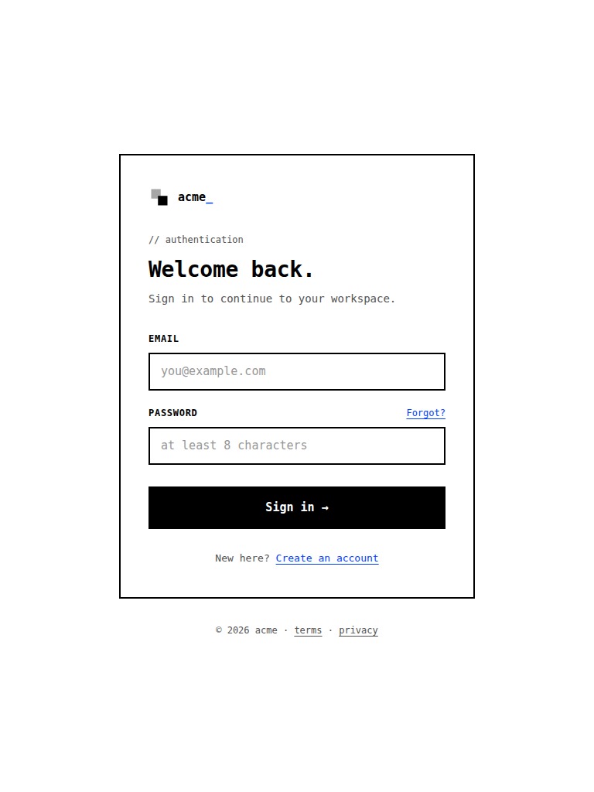
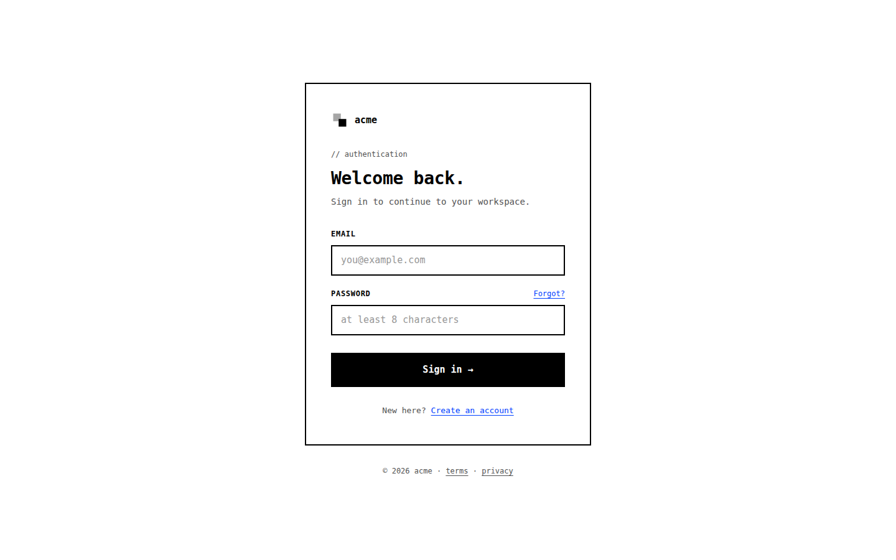

# Login — Mono Stark

> Brutalist login page. JetBrains Mono throughout, electric-blue accent, zero border-radius.

[](https://www.w3.org/TR/html52/) [](https://www.w3.org/Style/CSS/) []() []() []()

A single-screen login page built with pure HTML5 and CSS3. Mobile-first, fully accessible, no frameworks, no JavaScript.

| Property      | Value                                  |
|---------------|----------------------------------------|
| **Mood**      | Brutalist, raw                         |
| **Accent**    | `#0040ff`                             |
| **Typeface**  | JetBrains Mono                         |
| **Atmosphere**| Stark 2px black border, no radii, blinking cursor in the wordmark                   |
| **Theme**     | light                  |
| **Files**     | `login.html`, `styles.css`             |

## Preview

| Mobile (375px) | Tablet (768px) | Desktop (1440px) |
| :---: | :---: | :---: |
|  |  |  |

## Quick start

```bash
git clone https://github.com/<your-user>/05-mono-stark.git
cd 05-mono-stark
open login.html        # macOS — or just double-click the file
```

That's the whole setup. No build step, no `npm install`, no bundler.

## Deploy to GitHub Pages

After pushing this repo to GitHub:

1. Go to **Settings → Pages**
2. Under "Build and deployment", set **Source** to *Deploy from a branch*
3. Pick branch `main`, folder `/` (root), then **Save**

Your page goes live at `https://<your-user>.github.io/05-mono-stark/login.html` within a minute.

The repo includes a `.nojekyll` file so GitHub Pages serves all files as-is, including ones whose names start with an underscore.

## Customize

All visual identity lives in CSS variables at the top of `styles.css`. Change one and the whole page updates.

```css
:root {
  --color-accent:       #0040ff;   /* primary brand color */
  --color-accent-hover: ...;        /* hover state */
  --color-bg:           ...;        /* page background */
  --color-surface:      ...;        /* card / input bg */
  --color-text:         ...;        /* body & headings */
  --color-text-muted:   ...;        /* secondary text */
  --color-border:       ...;        /* default border */
  --color-danger:       ...;        /* invalid state */
  --color-focus-ring:   ...;        /* focus ring (low-alpha accent) */
}
```

When changing `--color-accent`, also update `--color-focus-ring` to a low-alpha version of the same color so the focus state stays cohesive.

### Swap the typeface

1. **HTML** — replace the Google Fonts `<link>` in `<head>`
2. **CSS** — update the `--font-sans` (or `--font-serif`/`--font-mono`) variable in `:root`

To drop the Google Fonts dependency entirely, remove the `<link>` and use the system fallback chain that's already in place.

### Adjust breakpoints

```css
@media (min-width: 600px)  { /* tablet */ }
@media (min-width: 1024px) { /* desktop */ }
```

Layout is mobile-first; base styles cover 320–599px. The card has a `max-width` so it stops growing on large screens — the page remains comfortable up to 1440px+ without horizontal scroll.

## What's inside

- **Semantic markup** — `<main>`, `<header>`, `<footer>`, `<section aria-labelledby>`
- **Real labels** for every input — no label-by-placeholder anti-patterns
- **`autocomplete` hints** (`username`, `current-password`) — password managers work out of the box
- **`inputmode="email"`** for the right mobile keyboard
- **Native browser validation** via `required`, `type="email"`, and `minlength`
- **`:user-invalid` styling** — error state appears only after the user has interacted, not on first paint
- **Visible `:focus-visible` outlines** on every interactive element
- **WCAG AA color contrast** at every text size
- **`prefers-reduced-motion`** — transitions collapse to ~0ms when set
- **`100dvh` with `100vh` fallback** — fills the viewport correctly on mobile browsers

## Form integration

The form is wired to `action="#" method="post"` as a stub. Point it at your real endpoint:

```html
<form class="auth-form" action="/api/login" method="post">
```

Browser-native validation runs automatically — no JavaScript needed.

## Browser support

- Chrome / Edge — last 2 versions
- Firefox — last 2 versions
- Safari 16.5+ (for `:user-invalid`)
- Mobile Safari, Chrome Android, Samsung Internet — current

## Verified

- ✅ W3C HTML validator — 0 errors, 0 warnings
- ✅ W3C CSS validator — 0 errors
- ✅ Console on load — 0 errors, 0 warnings
- ✅ Layout 320–1440px — no overflow, no horizontal scroll
- ✅ Lighthouse Accessibility — 100 / 100

## License

[MIT](LICENSE) © 2026

---

This is one of eight palette variants. See the [showcase](https://github.com/<your-user>/login-pages) for the full set.
